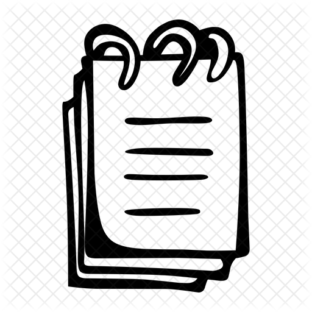

#                               Sticky Notes




This is a simple sticky notes app built with Electron. It supports multiple windows, each note is independent, content is auto-saved, and you can adjust font size or delete notes via the menu bar and shortcuts.

## Features

- **Multiple Windows**: Create as many notes as you want via the "New Note" menu. Each note is independent.
- **Auto Save**: Each note's content is automatically saved locally. Closing a window does not lose your data; reopening restores it.
- **Font Size Adjustment**: Change the font size for each note independently from the menu bar.
- **Shortcuts**:
  - `Cmd/Ctrl+N` — New note window
  - `Cmd/Ctrl+D` — Delete (close) current note window
  - `Cmd/Ctrl+K` — Clear current note content
- **Clean UI**: Rounded corners, shadow, and gradient background for a pleasant experience.


## Usage

1. Install dependencies:

   ```bash
   npm install
   ```

2. Start the app:

   ```bash
   npm start
   ```

3. Common operations:
   - Use the menu bar "File" → "New Note" to open a new note window.
   - Use the "Font Size" menu to adjust the font size of the current note.
   - Use `Cmd/Ctrl+D` to quickly close the current note window.
   - Use `Cmd/Ctrl+K` to clear the content of the current note.

## Project Structure

```
note/
├── main.js         # Main process: window and menu logic
├── preload.js      # Preload script: main/renderer communication
├── index.html      # Renderer process HTML
├── renderer.js     # Renderer process logic
├── style.css       # Styles
└── README.md       # Project documentation
```

## Dependencies

- [Electron](https://www.electronjs.org/)


## Roadmap

| Function                                  | Status  |
| ----------------------------------------- | ------- |
| Save the Note to Local                    | Ongoing |
| More Custom Features                      | Ongoing |
| Support Markdown like Typora and Obsidian | Planned |
| Multi-platform support                    | Planned |


## Notes

- This app currently only support macOS and Win-X86(but still a bit buggy)

- **If you see a “Cannot open the application” warning, please follow [this guide](https://sspai.com/post/27638) to open it manually.** This is due to the lack of an official developer certificate, which is too expensive to obtain.

  Similarly, if you encounter the error **“is damaged and can’t be opened. You should move it to the Trash”**, please refer to [this guide](https://zhuanlan.zhihu.com/p/135948430) to resolve it.

- You can customize window size, style, or shortcuts by editing `main.js`, `style.css`, etc.

---

Enjoy and feel free to customize!